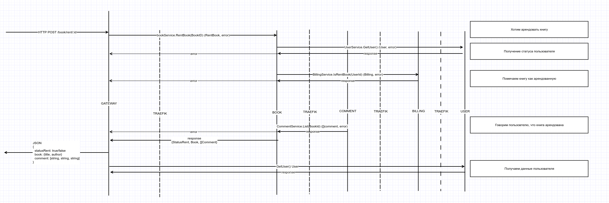
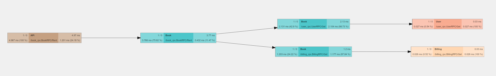
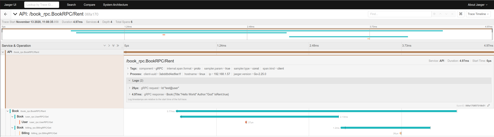

# microservice-template by ddd

DDD example use micriservices.

### Getting Started

```
# Get help
make help

# Run services
make run

# Stop services
make down
```

##### Prerequisites

+ docker
+ docker-compose
+ protoc 3.7.1+

### Service

| Name        | Port  | Description Endpoint          |
|-------------|-------|-------------------------------|
| traefik     | 80    | HTTP                          |
| traefik     | 443   | HTTPS                         |
| traefik     | 8060  | Dashboard                     |
| api         | 7070  | HTTP API                      |
| user        | 50051 | gRPC Server                   |
| billing     | 50051 | gRPC Server                   |


### Architecture

```
.
├── /cmd/                       # Run service endpoint
│   ├── /user/                  # User service
│   ├── /book/                  # Book service
│   └── /billing/               # Billing service
├── /pkg/                       # The public source code of the application
├── /internal/                  # The private source code of the application
│   └── /bookService/           # Book service source code
│       ├── /useCases/          # Write business logic [./application]
│       ├── /domian/            # Entity struct that represent mapping to data model
│       └── /infrastructure/    # Solves backend technical topics
│           ├── /store/         # Store delivery [../repository]
│           ├── /rpc/           # RPC delivery
│           └── /mq/            # MQ delivery
├── /ops/                       # All infrastructure configuration for IoC
├── .gitignore                  # A gitignore file specifies untracked files
└── README.md                   # README
```

### HTTP API

+ Import [Postman link](./docs/microservice-template-ddd.postman_collection.json) for
  test HTTP API

### Request example



##### Opentracing example request



