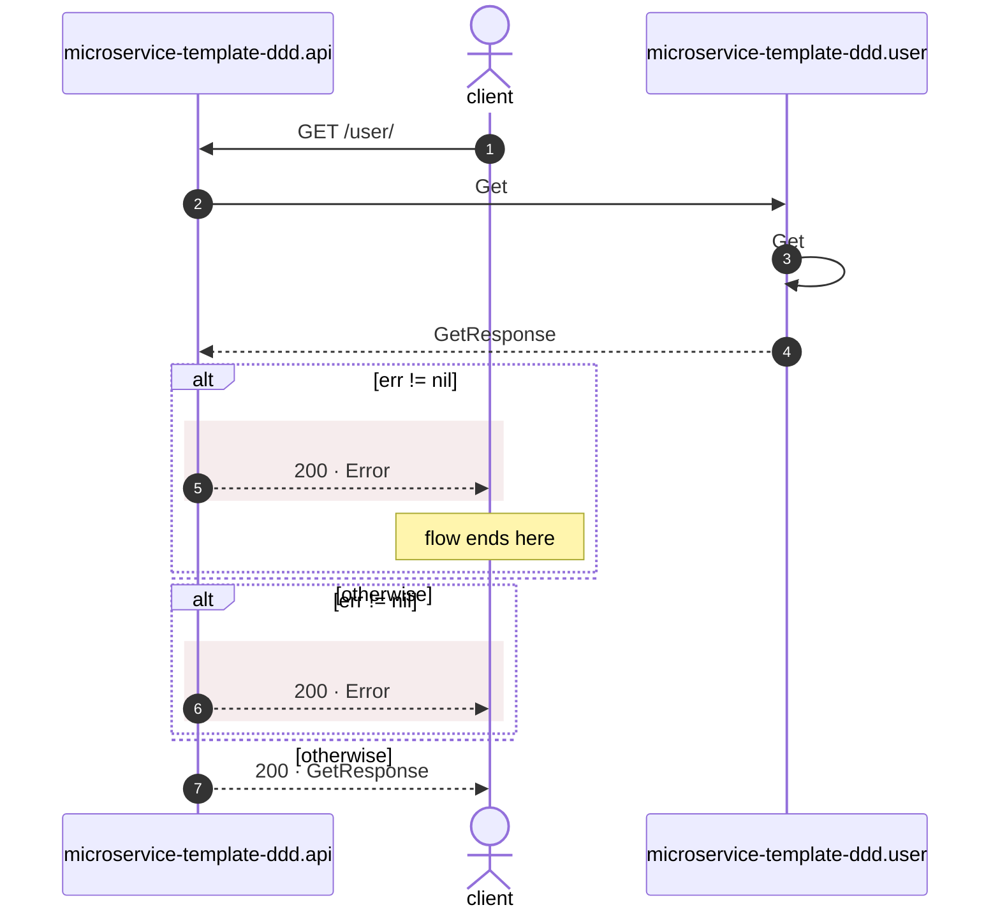

# GET /user/

*Generated from the portolan catalog · commit `baebd80` · at 2026-09-09T21:28:15+07:00. Do not edit by hand.*

- **Id:** `flow.api-http-get-user`
- **Owner:** [microservice-template-ddd](../microservice-template-ddd/README.md)
- **Trigger:** `http` · GET /user/
- **Root confidence:** high
- **Source:** `internal/api/http/routes_user.go`

Source-derived http execution path for `GET /user/`. Source-backed cross-protocol continuations are included.

## Participants

| Participant | Kind | Context |
| --- | --- | --- |
| `microservice-template-ddd.api` | service | [microservice-template-ddd](../microservice-template-ddd/README.md) |
| `client` | actor | — |
| `microservice-template-ddd.user` | service | [microservice-template-ddd](../microservice-template-ddd/README.md) |

## Sequence

## Steps

1. **client** → **microservice-template-ddd.api** — GET /user/
   status: declared · `internal/api/http/routes_user.go:18`

2. **microservice-template-ddd.api** → **microservice-template-ddd.user** — Get
   `user_rpc.UserRPC/Get` · status: declared · `internal/api/http/routes_user.go:33`

3. **microservice-template-ddd.user** ↺ **microservice-template-ddd.user** — Get
   status: declared · `internal/user/infrastructure/rpc/grpc.go:46`

4. **microservice-template-ddd.user** → **microservice-template-ddd.api** — GetResponse
   status: declared · Synthesized from the proven synchronous unary gRPC return.

> **One of**
>
> *err != nil — *ends the flow**
>
> 
> 5. **microservice-template-ddd.api** → **client** — 200 · Error
>    status: declared · `internal/api/http/routes_user.go:36` · HTTP · 200 · `application/json` · json · error · fields: error: string · warning: Error response has no explicit non-2xx status; net/http will send 200.
>
> *otherwise*

> **One of**
>
> *err != nil*
>
> 
> 6. **microservice-template-ddd.api** → **client** — 200 · Error
>    status: declared · `internal/api/http/routes_user.go:44` · HTTP · 200 · `application/json` · json · error · fields: error: string · warning: Error response has no explicit non-2xx status; net/http will send 200. Execution continues after writing the error body and may append another response.
>
> *otherwise*

7. **microservice-template-ddd.api** → **client** — 200 · GetResponse
   status: declared · `internal/api/http/routes_user.go:47` · HTTP · 200 · `application/json` · protojson · success · body derived from `user_rpc.UserRPC/Get`
