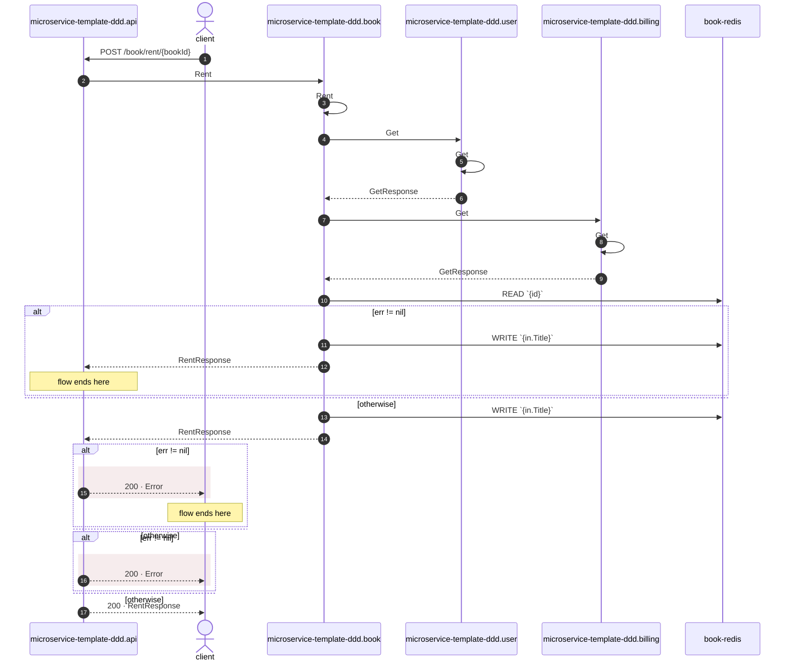

# POST /book/rent/{bookId}

*Generated from the portolan catalog · commit `498f577` · at 2026-09-09T01:20:07Z. Do not edit by hand.*

- **Id:** `flow.api-http-post-book-rent-bookid`
- **Owner:** [microservice-template-ddd](../microservice-template-ddd/README.md)
- **Trigger:** `http` · POST /book/rent/{bookId}
- **Root confidence:** high
- **Source:** `internal/api/http/routes_book.go`

Source-derived http execution path for `POST /book/rent/{bookId}`. Source-backed cross-protocol continuations are included.

## Participants

| Participant | Kind | Context |
| --- | --- | --- |
| `microservice-template-ddd.api` | service | [microservice-template-ddd](../microservice-template-ddd/README.md) |
| `client` | actor | — |
| `microservice-template-ddd.book` | service | [microservice-template-ddd](../microservice-template-ddd/README.md) |
| `microservice-template-ddd.user` | service | [microservice-template-ddd](../microservice-template-ddd/README.md) |
| `microservice-template-ddd.billing` | service | [microservice-template-ddd](../microservice-template-ddd/README.md) |
| `book-redis` | store | [microservice-template-ddd](../microservice-template-ddd/README.md) |

## Sequence

## Steps

1. **client** → **microservice-template-ddd.api** — POST /book/rent/{bookId}
   status: declared · `internal/api/http/routes_book.go:23`

2. **microservice-template-ddd.api** → **microservice-template-ddd.book** — Rent
   `book_rpc.BookRPC/Rent` · status: declared · `internal/api/http/routes_book.go:65`

3. **microservice-template-ddd.book** ↺ **microservice-template-ddd.book** — Rent
   status: declared · `internal/book/infrastructure/rpc/rent.go:8`

4. **microservice-template-ddd.book** → **microservice-template-ddd.user** — Get
   `user_rpc.UserRPC/Get` · status: declared · `internal/book/application/rent.go:53`

5. **microservice-template-ddd.user** ↺ **microservice-template-ddd.user** — Get
   status: declared · `internal/user/infrastructure/rpc/grpc.go:46`

6. **microservice-template-ddd.user** → **microservice-template-ddd.book** — GetResponse
   status: declared · Synthesized from the proven synchronous unary gRPC return.

7. **microservice-template-ddd.book** → **microservice-template-ddd.billing** — Get
   `billing_rpc.BillingRPC/Get` · status: declared · `internal/book/application/rent.go:59`

8. **microservice-template-ddd.billing** ↺ **microservice-template-ddd.billing** — Get
   status: declared · `internal/billing/infrastructure/rpc/grpc.go:46`

9. **microservice-template-ddd.billing** → **microservice-template-ddd.book** — GetResponse
   status: declared · Synthesized from the proven synchronous unary gRPC return.

10. **microservice-template-ddd.book** → **book-redis** — READ `{id}`
   status: declared · `internal/book/application/rent.go:36`

> **One of**
>
> *err != nil — *ends the flow**
>
> 
> 11. **microservice-template-ddd.book** → **book-redis** — WRITE `{in.Title}`
>    status: declared · `internal/book/application/rent.go:39`
> 
> 12. **microservice-template-ddd.book** → **microservice-template-ddd.api** — RentResponse
>    status: declared · Synthesized from the proven synchronous unary gRPC return.
>
> *otherwise*

13. **microservice-template-ddd.book** → **book-redis** — WRITE `{in.Title}`
   status: declared · `internal/book/application/rent.go:76`

14. **microservice-template-ddd.book** → **microservice-template-ddd.api** — RentResponse
   status: declared · Synthesized from the proven synchronous unary gRPC return.

> **One of**
>
> *err != nil — *ends the flow**
>
> 
> 15. **microservice-template-ddd.api** → **client** — 200 · Error
>    status: declared · `internal/api/http/routes_book.go:68` · HTTP · 200 · `application/json` · json · error · fields: error: string · warning: Error response has no explicit non-2xx status; net/http will send 200.
>
> *otherwise*

> **One of**
>
> *err != nil*
>
> 
> 16. **microservice-template-ddd.api** → **client** — 200 · Error
>    status: declared · `internal/api/http/routes_book.go:76` · HTTP · 200 · `application/json` · json · error · fields: error: string · warning: Error response has no explicit non-2xx status; net/http will send 200. Execution continues after writing the error body and may append another response.
>
> *otherwise*

17. **microservice-template-ddd.api** → **client** — 200 · RentResponse
   status: declared · `internal/api/http/routes_book.go:79` · HTTP · 200 · `application/json` · protojson · success · body derived from `book_rpc.BookRPC/Rent`
